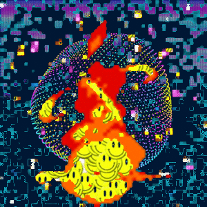

### About

This is a webpack loader which takes gifs as its input. Specifically, it takes their path as the value to `require`, and
the query params of the path are read for further instructions. The output (return value of `require`) is a string - 
a temporary path of a modified gif or webm.

Only gifs can receive modifications (so far), but the modified gifs can be converted to webm (preserving resizing and transparency).

Gifs can also be merged, creating multi-layered animations that make use of
the transparency.

The inspiration for writing with this was the Phaser.js example of webm video
with an alpha channel. Gifs only have a pseudo alpha channel but there are much
more accessible tools for manipulating them. Plus with some help I managed to
convert transparent gifs to transparent webms. Once I'd gathered shell scripts
to do these things, I wondered how it would work in a webpack loader. Thus
this project was borne. 

### Building a sample webpack application with animation-loader

1. _NPM packages_  

    the package is on NPM.

    ```sh
    npm install --save webpack webpack-dev-server
    npm install --save jquery coffee-loader # this is optional, but it's used for this guide
    npm install --save animation-loader
    ```

    also add this in the scripts section of `package.json`:  

    ```json
    "scripts": { "dev": "./node_modules/.bin/webpack-dev-server --content-base . --inline --hot" }
    ```

2. _System dependencies_  

    This loader makes use of childProcess calls and requires the system to have 
    these Unix programs (these instructions for Ubuntu, but they're common libraries and should be available 
    on most distributions and osX):
    ```sh
    sudo apt-get install ffmpeg imagemagick
    ```

2. In `webpack.config.js`:  

    This sets up `loader.coffee` to be the entry point of the application.  
    `bundle.js` is an in-memory concatenation built by webpack.  
    ```js
    module.exports = {
      entry: './loader.coffee',
      output: {
        filename: 'bundle.js'
      },

      module: {
        loaders: [
          { test: /\.coffee$/, loader: "coffee-loader" },
          { test: /\.gif$/, loader: ['raw-loader', "animation-loader"] },
        ]
      },

      resolve: {
        extensions: [".coffee", ".js", ".gif"],
      }
    }

    ```

3. Place the following gif saved as `octopus.gif` in the root of the repo:  

    _note_ I i did not create this, got it by literally searching google images for 'gif'  

    


4. Add this small `index.html` file:  

    ```html
    <!doctype html>
    <html lang="en">
      <head></head>
      <body><script src="bundle.js"></script></body>
    </html>
    ```

5. Populate `loader.coffee` with this:  

    ```coffee
    $ = require 'jquery'
    $ ->
      webm_path = require "./octopus.gif?transparent=true&color=00AEFF&resize=150x100"
      $("body").append($ """
        <video autoplay loop src="./#{foo}">
      """)
    ```
    
    I should mention that I don't feel this require string is very pretty, but webpack
    requires every string passed to require be statically analyzable and therefore it can have no
    variables. At least it's terse :D

6. Start the server with `npm run dev` and visit http://localhost:8080

7. Observe the following image now present on the page:  

     

   It has been resized and also made transparent on the light blue color `#00AEFF`.  


### Other notes

The `.animation-loader` folder is where the modified assets are stored. It is automatically created.
It is cleared out every time the server starts. Perhaps in the future it will implement caching that persists across restarts.
It can be added to `.gitignore` since everything in there is dynamically generated.

Phaser and HTML have a way to scale videos, so resizing them in a preprocessor is not necessarily needed. However it can improve the performance.

### API details

Once the webpack setup is in place, there's only one place this loader becomes relevant and that's `require`. With the proper
`test` definition in `webpack.config.js` (shown above), `gif` paths passed to `require` will pass through both the raw-loader and animation-loader.

If nothing else is given besides the path, the return value will be the absolute path:

```coffee
the_path = require './octopus.gif'
console.log the_path 
# => "/home/max/my_game/octopus.gif"
```

With the exception of `merge`, everything else is found in the query params. Here is the full list of keys:

- `transparent` if this is truthy then the following keys are checked  
    - `color` a hex code like `000000` (black) or `FFFFFF` (white). Defaults to black.
    - `fuzz` the percent leniency when turning color into transparency. Defaults to 25
- `resize` the value is a width/height such as `"1400x1400"`
- `to_webm` a boolean. the output path will be webm 
- `name` - used to identify a gif so it can be merged with another.  
  If provided, this also becomes the final filename, i.e.
  `.animation-loader/foo.gif` if `foo` is the name.

Merging:

Conceptually this takes two existing files and creates a new one, combing them.
However, Webpack doesn't make it easy to write a loader which is passed a filepath that _doesnt yet exist_.
(I think it is possible with a plugin, but that will require some work). To get around this, the loader
automatically creates an empty `.merge.gif` file at the root of the project that can be required to start a merge command.
This can be added to `.gitignore` of course.

If a source file is in the `lib/` directory, for example, the require path will need to be modified:
`require '../.merge.gif'` and if the source file is in the root of the repo, it would be `require '.merge.gif'`

If this file is passed to require, then three query params need to be present as well:

- `size` width/height e.g. "500x500". Imagemagick needs this info as part of the merge command, even if both gifs are the same size.
- `background` - the `name` of the image with the lower z-index
- `foreground` - the `name` of the image with higher z-index (probably the transparent one) 

This loader can't merge webm videos or doing any manipulations on them, so conversion to webm should happen
as the last step.

The merge command can be passed a 'name' as well. That way multiple merges can be layered.

### Examples

**turn all green in an image to transparent (like a greenscreen)**

`gif_path = require './my_image.gif?transparent=true&color=00FF00'`

**make only a very specific color transparent (set fuzz to 0)**

`gif_path = require './my_image.gif?transparent=true&color=F3F4F5&fuzz=0'`

**resize a gif**

`gif_path = require './my_image.gif?resize=500x500'`

**convert to webm (note that this works with any of the other commands)**

`webm_path = require './my_image.gif?to_webm'`

**referencing a dynamically generated gif by setting its `name`**

The path will be `"./.animation-loader/<name>.<ext>"`,
where `<ext>` is gif unless `to_webm` was specified, in which case it's webm

However this loader does not yet implement any transformations for webm, so webm paths are
never passed to require. 

```coffee
gif_version = require './my_image.gif?resize=100x200&name=gif_version'
webm_version = require './.animation-loader/gif_version.gif?to_webm=true'
```

Since the `.animation-loader` folder is in the root of the repo the path may have to be adjusted depending on the location of the file.

**merge a background with a partly-transparent foreground**

```coffee
foreground = require './my_image.gif?transparent=true&name=foreground'
background = require './my_image.gif?name=background'
merged = require './.merge.gif?size=200x200&background=background&foreground=foreground&name=merged'
```

**merge on a merge**

in this example, img2 is made transparent on black and merge1 is made transparent
on green.

```coffee
img1 = require './img1.gif?name=img1&resize=100x100'
img2 = require './img2.gif?name=img2&resize=100x100&transparent=true'
img3 = require './img3.gif?name=img2&resize=100x100'

merge1 = require './.merge.gif?name=merge1&background=img1&foreground=img2&size=100x100&transparent'
merge2 = require './.merge.gif?name=merge2&background=img3&foreground=merge1&size=100x100'
```

Here's an example of an image created with this technique:



### Source code

This is written in coffeescript, but it's all in one file, so compilation is
done through `coffee -wc index.coffee` which updates `index.js` (the entry
point specified in `package.json`).

The file has comments, and of course contribution is valued.
